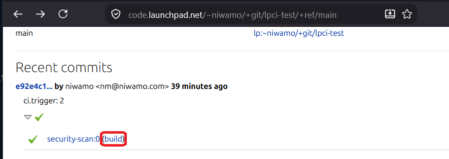
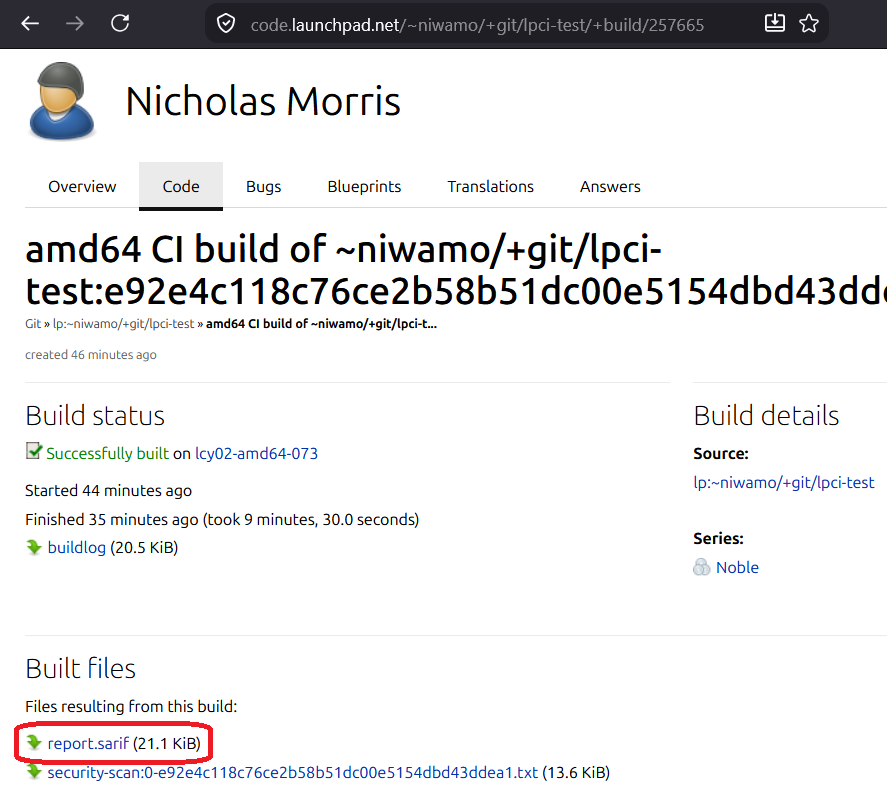

# Scan with Launchpad CI

Unlike GitHub, Launchpad has no reusable-actions. So, instead of a published
action, reposcan offers a standard `.launchpad.yaml` job config. The job
installs and runs reposcan in the `lpci` build container and scans the
checked-out tree.

The results are a findings summary in the build log and a SARIF report attached
as a build artifact.

## Basic usage

Add `.launchpad.yaml` to the repository root, or add the `security-scan` job
config to your existing `.launchpad.yaml`:

```yaml
pipeline:
  - security-scan

jobs:
  security-scan:
    series: noble
    architectures: amd64
    packages: [git, python3, python3-pip, ca-certificates]
    snaps:
      - name: astral-uv
        classic: true
    environment:
      # Pin @main to a tag or commit for reproducible builds.
      REPOSCAN: uvx --from git+https://github.com/canonical/reposcan@main reposcan
      # Fail the build on a finding at or above this level: error, warning, note,
      # or none (report only, never fail).
      FAIL_ON: error
    run: |
      set +e
      mkdir -p results
      $REPOSCAN bootstrap --confirm || { echo "reposcan bootstrap failed"; exit 1; }
      $REPOSCAN --backend local scan all . -o results/report.sarif --fail-on "$FAIL_ON"
      rc=$?
      $REPOSCAN render results/report.sarif || true   # findings summary in the log
      # rc 0: nothing at or above FAIL_ON, the build passes. rc 3: findings, the
      # build fails. rc 1 or 2: a real scan error, the build fails.
      [ "$rc" = 0 ]
    output:
      paths: [results/*]
```

The scan requires outbound network access: `bootstrap` downloads the pinned
tools, and the scan step downloads rulesets.

## Choosing scans

`scan all` runs every security scan (secrets, sast, iac, workflow, sca). To run
a subset, name them comma-separated instead:

```yaml
      $REPOSCAN --backend local scan secrets,sast,sca . -o results/report.sarif
```

## Findings threshold

`FAIL_ON` sets the level at or above which a finding fails the build, matching
reposcan's `--fail-on`. It accepts `error` (the default here), `warning`,
`note`, or `none`. `none` reports findings but never fails on them.

Launchpad keeps a job's artifacts only when the job succeeds. So when a build
fails on findings, the SARIF report is not retained, though the findings summary
is still in the build log. To keep the report available on every run, set
`FAIL_ON: none`; the build then stays green and the report is always attached.

## Results in the build log

The `reposcan render` line prints a findings table to the build log, so the
outcome is visible on the build page without downloading the SARIF report:

```
LEVEL    TOOL        RULE   LOCATION        MESSAGE
error    trufflehog  AWS    config.env:1    AWS secret detected (verified)
```

## Retrieving the SARIF report

### From the build page

Open the build page for your run. It lists each artifact as a download link,
including `report.sarif`.

<!-- Screenshot: the repository's recent commit with its CI status -->



<!-- Screenshot: the build page showing report.sarif in the artifacts list -->



### With a script

```python
#!/usr/bin/env python3
"""Download the latest reposcan SARIF from a Launchpad CI build.

Usage: fetch-sarif.py ~owner/+git/repo [branch]   # branch defaults to main
"""

import json
import sys
import urllib.parse
import urllib.request

API = "https://api.launchpad.net/devel"


def get(url: str):
    with urllib.request.urlopen(url) as response:
        return json.load(response)


def main() -> int:
    if len(sys.argv) < 2:
        sys.stderr.write("usage: fetch-sarif.py <~owner/+git/repo> [branch]\n")
        return 2
    repo = sys.argv[1].lstrip("/")
    branch = sys.argv[2] if len(sys.argv) > 2 else "main"
    base = f"{API}/{repo}"

    sha = get(f"{base}/+ref/{branch}")["commit_sha1"]
    query = urllib.parse.urlencode({"ws.op": "getStatusReports", "commit_sha1": sha})
    reports = get(f"{base}?{query}")["entries"]
    if not reports:
        sys.stderr.write(f"no CI report for {branch} ({sha[:12]})\n")
        return 1

    report = max(reports, key=lambda r: r["date_created"])  # the most recent run
    page = report["ci_build_link"].replace(f"{API}/", "https://code.launchpad.net/")
    print(f"build page: {page}  ({report['result']})")

    urls = get(f"{report['self_link']}?ws.op=getArtifactURLs")
    sarif = next((url for url in urls if url.endswith("report.sarif")), None)
    if sarif is None:
        sys.stderr.write("no report.sarif among the build's artifacts\n")
        return 1
    urllib.request.urlretrieve(sarif, "report.sarif")
    print("wrote report.sarif")
    return 0


if __name__ == "__main__":
    raise SystemExit(main())
```

Run it with `python3 fetch-sarif.py ~owner/+git/repo`. It prints the build page
URL and writes `report.sarif` to the current directory.

## Limitations

- Launchpad has no code-scanning dashboard, so the SARIF report is a
  downloadable file, not a rendered view. Nothing consumes it automatically.
- Artifacts are retained only on a successful build (see the threshold section).
- Unlike the GitHub Action, there is no merge-proposal comment.
